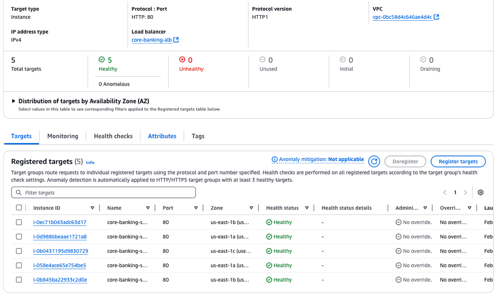

# Month 2 Week 5 DevOps Assignment - Core Banking Infrastructure as Code

Welcome to the Month 2 Week 5 Assignment! This is a hands-on project focused on Infrastructure as Code (IaC) using Terraform and Ansible. This is a mini 😭 not-so-mini project where we harness the power of AWS to set up a Virtual Private Cloud (VPC) and deploy a Node.js application. Buckle up, because we're diving into the world of cloud infrastructure, automation, and deployment!

## Project Overview

This project uses AWS to provision a VPC with all the bells and whistles: 25 EC2 instances (or as needed), Elastic Cache with Memcached (because Redis OSS isn't available on the free tier 🌚.., money no be water as we say in pidgin), Route 53 for DNS management, security groups, subnets, key pairs, and more. We also deploy a Node.js application that integrates with Memcached in production and uses redis in development and all this where made possible and seamless using using Ansible and Terraform for seamless deployment. (you people no dey quick share update 😓)

## Project Structure
```plaintext
├── .gitignore
├── .vscode/
│   └── settings.json
├── ansible/
│   ├── ansible.cfg
│   ├── inventory_aws_ec2.yml
│   ├── playbook.yml
│   └── roles/
│       ├── docker/
│       │   └── tasks/
│       │       └── main.yml
│       └── app_deploy/
│           └── tasks/
│               └── main.yml
├── app/
│   ├── cache-config.js
│   ├── Dockerfile
│   ├── package.json
│   ├── server.js
│   ├── session-factory.js
│   └── utils.js
├── docker-compose.dev.yml
├── docker-compose.prod.yml
├── Dockerfile
├── nginx.conf
├── nginx.prod.conf
├── README.md
├── terraform/
│   ├── data.tf
│   ├── ec2.tf
│   ├── key_pairs.tf
│   ├── main.tf
│   ├── output.tf
│   ├── plan.out
│   ├── provider.tf
│   └── terraform.tfvars
└── deploy.sh
```

## Quick navigations
Here's a clickable overview of the project structure:

- [terraform/](./terraform/)
    - [main.tf](./terraform/main.tf)
    - [variables.tf](./terraform/variables.tf)
    - [terraform.tfvars](./terraform/terraform.tfvars)
- [ansible/](./ansible/)
    - [playbook.yml](./ansible/playbook.yml)
    - [inventory.yml](./ansible/inventory_aws_ec2.yml)
    - [ansible.cfg](./ansible/ansible.cfg)
- [deploy.sh](./deploy.sh)
- [node app](./app)
    - [Dockerfile](./app/Dockerfile)
    - [server](./app/server.js)
    - [package.json](./app/package.json)
- [docker-compose.dev.yml](./docker-compose.dev.yml)
- [docker-compose.prod.yml](./docker-compose.prod.yml)
- [README.md](./README.md)


## What This Project Does

- **VPC Creation**: We start by creating a VPC to isolate our resources in a secure network.
- **Subnets and Security Groups**: We define subnets and security groups to control traffic flow and enhance security.
- **EC2 Instances**: We spin up 25 EC2 instances (or as needed) to host our application.
- **Elastic Cache with Memcached**: We set up Elastic Cache with Memcached to handle caching, as Redis OSS isn't available on the free tier.
- **Route 53**: We use Route 53 for DNS management, ensuring our application is accessible via a friendly domain name.
Key Pairs: We generate key pairs for secure SSH access to our EC2 instances.
- **Node.js Application Deployment**: We deploy a Node.js application that integrates with Memcached. During deployment, Ansible retrieves the Memcached endpoint and port, passing them into the Docker Compose environment to configure the application container.
- **Nginx Configuration**: We configure Nginx as a reverse proxy on each EC2 instance to handle incoming requests and forward them to the Node.js application.
- **Load Balancer**: We set up a load balancer to distribute traffic across multiple Availability Zones (AZs), ensuring high availability and fault tolerance.
Why This Project is Awesome
- **Automation**: Everything is automated using Ansible, making deployment a breeze.
- **Scalability**: The infrastructure is designed to scale, with a load balancer distributing traffic across multiple AZs.
- **Security**: We use security groups and key pairs to ensure our resources are secure. (and i added a little mix, ssh is only allowed fro the IP of the machine where this infra was created from 😋)
- **Integration**: The Node.js application seamlessly integrates with Memcached, thanks to Ansible's dynamic configuration.

## What I Learned

In this assignment, I learned:
- **Terraform**: How to define and provision infrastructure using code.
- **Ansible**: How to automate application deployment and configuration management.
- **AWS**: How to interact with AWS services to create and manage resources.
- **Docker**: How to containerize applications and manage them using Docker Compose.
- **Bash Scripting**: How to automate tasks using shell scripts.


## How to Run This Project

Before running this project, ensure you have the following prerequisites:

1. **AWS CLI**: Ensure you have the AWS CLI [installed and configured](https://aws.amazon.com/cli/).
2. **Terraform**: Install Terraform from [here](https://www.terraform.io/).
3. **Ansible**: Install Ansible from [here](https://docs.ansible.com/).
4. **Docker**: Install Docker from [here](https://www.docker.com/).

### Steps to Run

1. Clone the repository:
     ```bash
     git clone <repository-url>
     cd month2-week5-assignment
     ```

2. Modify the variables in `/terraform/terraform.tfvars` as needed:
     - `aws_profile`: The AWS profile to use for creating the infrastructure (default: "default").
     - `vm_count`: The number of VMs to create.
     - `db_password`: The database password.
     - Any other variables that need to be customized.

3. Run the deployment script:
     ```bash
     ./deploy.sh
     # or
     bash deploy.sh
     ```

And that's it! Watch as your infrastructure gets created and configured automatically.

You can see the health check of the instances


Happy coding!
